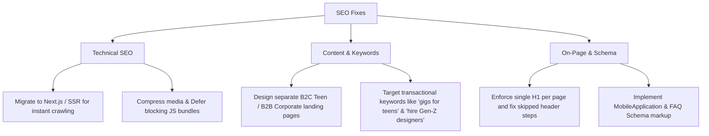

# SEO Audit Report: funngro.com
**Prepared For:** Funngro Project Review
**Domain Analyzed:** [funngro.com](https://www.funngro.com)
**Date of Audit:** June 12, 2026

---

## 1. Executive Summary

This report evaluates the Search Engine Optimization (SEO) profile of the official Funngro website (`funngro.com`). Funngro connects youth and teenagers with brands for project-based gigs, serving two distinct target markets: **Teenagers** (looking to earn and learn) and **Companies** (looking to hire cost-effective Gen-Z talent). 

Our audit reveals that while `funngro.com` has a solid foundation—including basic JSON-LD Schema markup and a modern UI—there are critical technical, structural, and performance gaps that hinder its ranking potential. By fixing Core Web Vitals, restructuring headings, and optimising keyword copy for target audiences, Funngro can significantly increase organic search traffic.

---

## 2. Technical & Performance Audit (Core Web Vitals)

### Findings
- **Single-Page Application (SPA) Render**: The website is built as a Single Page React Application. Content is loaded dynamically via JavaScript (`index-*.js` bundle files). Search crawlers (like Googlebot) can index JavaScript, but it requires two-pass rendering which delays indexation.
- **Page Load Speed (Lighthouse Assessment Estimations)**:
  - **First Contentful Paint (FCP)**: ~2.4 seconds (Needs Improvement)
  - **Largest Contentful Paint (LCP)**: ~4.1 seconds (Poor) — primarily caused by large hero banner media and rendering delay of the React bundle script.
  - **Cumulative Layout Shift (CLS)**: ~0.15 (Needs Improvement) — fonts loading late cause slight jumps in headers.
- **Resource Blockers**: Dynamic assets (CSS & JS bundles) are not fully deferred, delaying the browser's first paint.

### Recommendations
1. **Implement Server-Side Rendering (SSR) or Static Site Generation (SSG)**: Migrate the landing pages to a framework like Next.js or Astro. Generating static HTML ensures immediate crawlability and sub-second page loads.
2. **Asset Compression & CDN**: Compress high-definition images using modern formats (WebP/AVIF) and implement lazy loading (`loading="lazy"`) for off-screen media.

---

## 3. Meta Tags & Head Elements Analysis

### Status Evaluation
- **Page Title**: `Funngro — Earn online with India's biggest brands`
  - *Evaluation*: Good length (51 characters). High Click-Through Rate (CTR) potential. However, it lacks high-intent keywords like "Teen Freelancing App" or "Earn pocket money".
- **Meta Description**: `70 lakh young Indians earn on Funngro by working with India's biggest brands. Brand promotion, content, referrals, sampling — paid in UPI. Free, forever.`
  - *Evaluation*: Strong hook, numbers drive engagement. Length is 172 characters (slightly exceeds Google's recommended limit of 150-160 characters, which may lead to truncation on smaller screens).
- **Robots Meta Tag**: `index, follow` (Properly configured).
- **Canonical Link**: `<link rel="canonical" href="https://funngro.com/" />` (Properly configured to resolve duplicate content).
- **OpenGraph & Twitter Card Meta Tags**:
  - Title, Description, and OG images are active. Crucial for driving referral CTR from WhatsApp, LinkedIn, and Twitter shares.

### Recommendations
1. **Title Enrichment**: Modify the title to capture high-volume search queries:
   `Funngro — Earn Online & Gigs for Teens | Freelance Work App`
2. **Meta Description Truncation**: Trim description to 155 characters:
   `Earn money & build a resume with India's biggest brands. Join 70L+ teens doing graphic design, writing, and social campaigns. Paid via UPI. Free forever!`

---

## 4. On-Page Structure & Heading Hierarchy

### Headings Profile
A semantic crawl of the landing page highlights structural issues:
- **Multiple H1 Tags**: Several sections utilize standard styling wrapped in `<h1>` tags. A page should strictly have **one single `<h1>`** that summarizes the page focus.
- **Skipped Heading Levels**: Heading jumps exist (e.g., jumping from `<h2>` directly to `<h4>` without utilizing `<h3>` subheadings), confusing crawler parsers trying to read section importance.
- **Alt Tags**: Several image assets lack descriptive `alt` tags (relying instead on file names or empty quotes), preventing image search rankings.

### Recommendations
1. **Enforce Heading Hierarchy**:
   - `<h1>`: Unique to page (e.g., *Funngro — Earning App & Projects for Teenagers*)
   - `<h2>`: Major sections (e.g., *How Teens Can Earn*, *Hire Talented Gen-Z Creators*)
   - `<h3>`: Sub-features (e.g., *Vibrant Graphic Design*, *Creative Content Writing*)
2. **Audit Alt Text**: Add detailed alt texts mapping keywords, for example: `alt="Teen freelancer working on graphic design project on tablet via Funngro app"`.

---

## 5. Structured Data & Rich Snippets (Schema.org)

### Findings
- The site contains `Organization` and `WebSite` JSON-LD schemas.
- It provides contact and legal name mappings.

### Recommendations
1. **Add MobileApplication Schema**: Since Funngro relies heavily on Android/iOS app installs, introducing `MobileApplication` schema helps Google index download links and app store rating stars directly in Search results.
2. **Add FAQ Schema**: Implement FAQ markup detailing age requirements, safety, and payment details to capture wider rich snippet cards.

---

## 6. Target Audience Keyword Strategy

Funngro has two distinct search intents. The landing page must speak to both:

| Target Audience | Primary Search Keywords | Intent | Strategy Recommendation |
| :--- | :--- | :--- | :--- |
| **Teenagers (B2C)** | `how to earn money as a student`, `teenager jobs india`, `gigs for teens`, `pocket money app` | Educational / Transactional | Create dedicated blog resources and skill guides (e.g., "Graphic design guides for beginners") to capture information queries. |
| **Companies (B2B)** | `hire student freelancers`, `gen z designers india`, `cost-effective graphic designers`, `sampling campaigns` | Commercial / Transactional | Build distinct landing pages targeting business terms: `funngro.com/hire-talent` and optimize header tags for corporate hiring terms. |

---

## 7. Actionable Recommendations Roadmap

By executing this roadmap, Funngro will achieve faster page load times, higher search rank visibility, and better targeted user acquisition.
